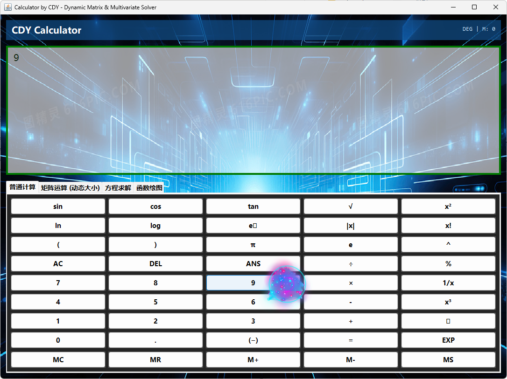
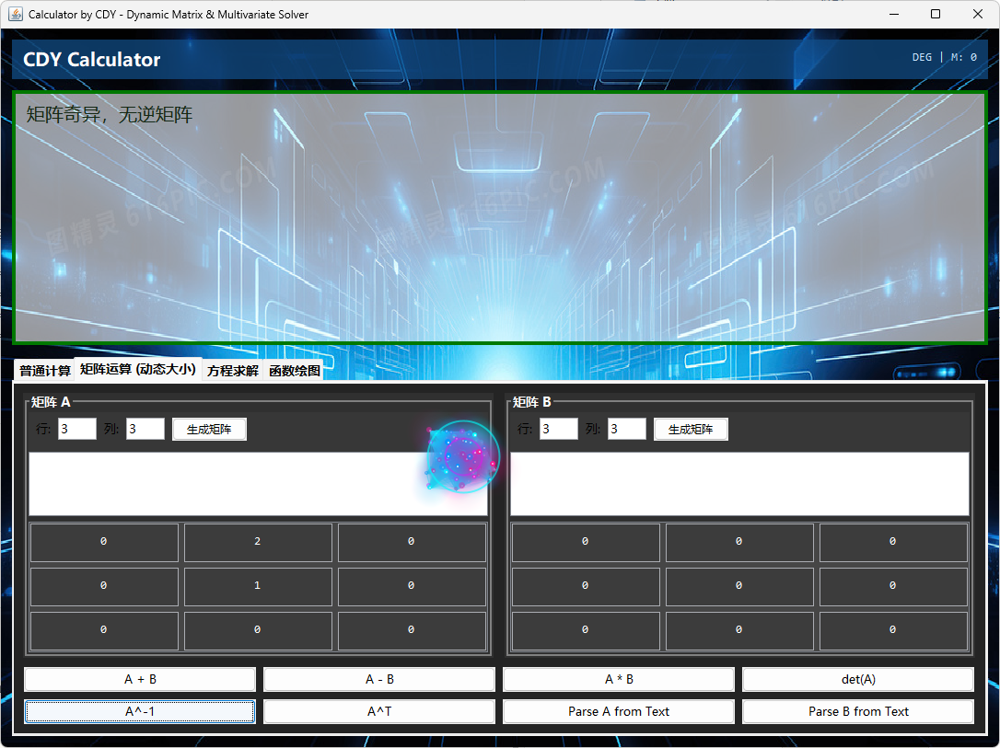
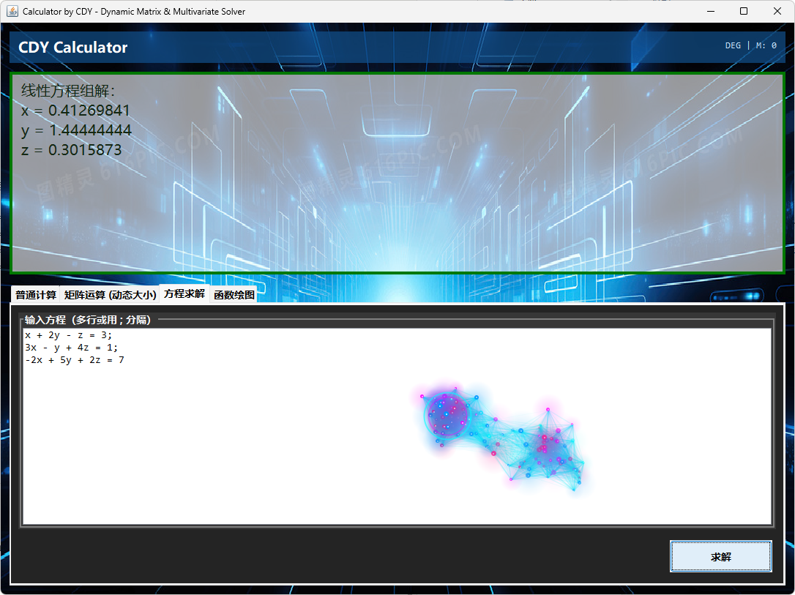
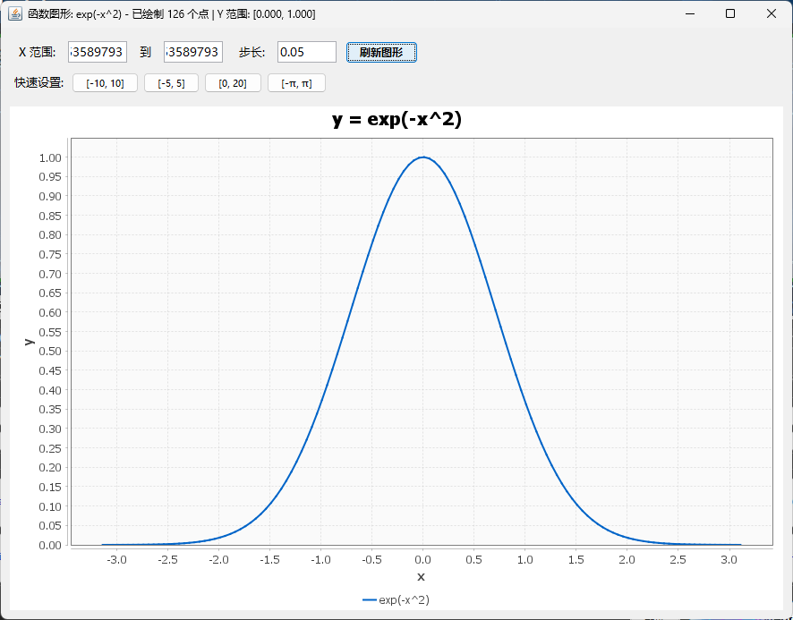

# Calculator by CDY

一个功能强大的 Java Swing 多功能科学计算器，具有炫酷的赛博朋克粒子特效和全面的数学计算能力。


## ✨ 主要特性

### 🎨 视觉效果
- **赛博朋克粒子系统**：鼠标移动时生成动态粒子轨迹
- **霓虹配色方案**：青色、洋红、粉红等赛博朋克风格配色
- **粒子连线效果**：粒子间智能连线形成网格效果
- **脉冲光环**：鼠标周围的动态脉冲圆环
- **半透明 UI**：现代化的毛玻璃效果界面
- **事件穿透**：粒子层不影响按钮点击操作

### 🧮 计算功能

#### 1. 普通计算器
- **基础算术运算**：加、减、乘、除、取余
- **科学函数**：
  - 三角函数：sin, cos, tan
  - 指数对数：ln, log, eˣ
  - 幂运算：x², x³, xⁿ, √, ∛
  - 其他：|x|, x!, 1/x, EXP
- **内存功能**：MC, MR, M+, M-, MS
- **ANS 答案回调**
- **常数**：π, e
- **实时显示**：支持直接编辑输入框

#### 2. 矩阵运算（动态大小）
- **动态矩阵生成**：支持自定义 N×M 矩阵大小（1×1 至 200×200）
- **灵活输入方式**：
  - 网格输入：直观的表格形式输入
  - 文本粘贴：支持多行文本快速输入矩阵
- **矩阵运算**：
  - 加法：A + B
  - 减法：A - B
  - 乘法：A × B
  - 行列式：det(A)
  - 逆矩阵：A⁻¹
  - 转置：Aᵀ
- **智能解析**：自动识别逗号、空格分隔的矩阵数据

#### 3. 方程求解
- **线性方程组**：高斯消元法求解多元一次方程组
  ```
  示例：
  x + 2y - z = 3
  3x - y + 4z = 1
  -2x + 5y + 2z = 7
  ```
- **非线性方程组**：牛顿-拉夫森法数值求解
  ```
  示例：
  x^2 + y^2 = 25
  x - y = 1
  ```
- **单变量方程**：二分法求根
- **智能识别**：自动判断线性/非线性方程组类型
- **多初始值策略**：提高复杂方程组的求解成功率

#### 4. 函数绘图
- **基础函数**：sin, cos, tan, exp, log, sqrt, 幂函数等
- **复合函数支持**：
  - 嵌套函数：sin(cos(x)), log(abs(x))
  - 四则运算：sin(x)*cos(x), x*exp(-x)
  - 复杂表达式：(x²-1)/(x²+1), exp(-x²)
- **交互式控制**：
  - 自定义 X 轴范围和采样步长
  - 快速预设：[-10,10], [-5,5], [0,20], [-π,π]
  - 鼠标滚轮缩放
- **自适应 Y 轴**：自动调整纵轴范围
- **异常值处理**：智能跳过无效点（如 log(0), sqrt(-1)）
- **内置帮助**：详细的函数格式说明和示例

## 🛠️ 技术栈

- **Java 8+**：核心编程语言
- **Swing**：GUI 框架
- **JFreeChart 1.5.3**：图表绘制
- **exp4j 0.4.8**：数学表达式解析
- **EJML 0.41**：线性代数运算库

## 📦 依赖库

### Maven 依赖

```xml
<dependencies>
    <!-- JFreeChart - 图表库 -->
    <dependency>
        <groupId>org.jfree</groupId>
        <artifactId>jfreechart</artifactId>
        <version>1.5.3</version>
    </dependency>
    
    <!-- exp4j - 表达式解析 -->
    <dependency>
        <groupId>net.objecthunter</groupId>
        <artifactId>exp4j</artifactId>
        <version>0.4.8</version>
    </dependency>
    
    <!-- EJML - 矩阵运算 -->
    <dependency>
        <groupId>org.ejml</groupId>
        <artifactId>ejml-simple</artifactId>
        <version>0.41</version>
    </dependency>
</dependencies>
```

### pom.xml 完整配置

```xml
<?xml version="1.0" encoding="UTF-8"?>
<project xmlns="http://maven.apache.org/POM/4.0.0"
         xmlns:xsi="http://www.w3.org/2001/XMLSchema-instance"
         xsi:schemaLocation="http://maven.apache.org/POM/4.0.0 
         http://maven.apache.org/xsd/maven-4.0.0.xsd">
    <modelVersion>4.0.0</modelVersion>

    <groupId>com.example</groupId>
    <artifactId>calculator-cdy</artifactId>
    <version>1.0.0</version>
    <packaging>jar</packaging>

    <name>Calculator by CDY</name>
    <description>Advanced Scientific Calculator with Particle Effects</description>

    <properties>
        <maven.compiler.source>8</maven.compiler.source>
        <maven.compiler.target>8</maven.compiler.target>
        <project.build.sourceEncoding>UTF-8</project.build.sourceEncoding>
    </properties>

    <dependencies>
        <dependency>
            <groupId>org.jfree</groupId>
            <artifactId>jfreechart</artifactId>
            <version>1.5.3</version>
        </dependency>
        <dependency>
            <groupId>net.objecthunter</groupId>
            <artifactId>exp4j</artifactId>
            <version>0.4.8</version>
        </dependency>
        <dependency>
            <groupId>org.ejml</groupId>
            <artifactId>ejml-simple</artifactId>
            <version>0.41</version>
        </dependency>
    </dependencies>

    <build>
        <plugins>
            <plugin>
                <groupId>org.apache.maven.plugins</groupId>
                <artifactId>maven-compiler-plugin</artifactId>
                <version>3.8.1</version>
                <configuration>
                    <source>8</source>
                    <target>8</target>
                </configuration>
            </plugin>
            <plugin>
                <groupId>org.apache.maven.plugins</groupId>
                <artifactId>maven-jar-plugin</artifactId>
                <version>3.2.0</version>
                <configuration>
                    <archive>
                        <manifest>
                            <mainClass>com.example.Main</mainClass>
                        </manifest>
                    </archive>
                </configuration>
            </plugin>
        </plugins>
    </build>
</project>
```

## 🚀 快速开始

### 系统要求
- **JDK 8** 或更高版本
- **Maven 3.6+**（用于依赖管理）
- **内存**：建议 512MB 以上
- **显示器分辨率**：建议 1280×720 以上

### 方法一：使用 Maven 运行

```bash
# 1. 克隆或下载项目
git clone <repository-url>
cd calculator-cdy

# 2. 编译项目
mvn clean compile

# 3. 运行程序
mvn exec:java -Dexec.mainClass="com.example.Main"

# 4. 或者打包成可执行 JAR
mvn clean package
java -jar target/calculator-cdy-1.0.0.jar
```

### 方法二：使用 IDE

#### IntelliJ IDEA
1. **File → Open** 选择项目文件夹
2. 等待 Maven 自动导入依赖
3. 右键 `Main.java` → **Run 'Main.main()'**

#### Eclipse
1. **File → Import → Maven → Existing Maven Projects**
2. 选择项目文件夹
3. 右键 `Main.java` → **Run As → Java Application**

#### VS Code
1. 安装 **Java Extension Pack** 和 **Maven for Java** 插件
2. 打开项目文件夹
3. 按 `F5` 或点击 `Main.java` 右上角的 **Run** 按钮

### 方法三：命令行编译（不使用 Maven）

```bash
# 1. 手动下载依赖 JAR 文件并放入 lib/ 目录

# 2. 编译
javac -cp "lib/*" -d bin src/main/java/com/example/*.java

# 3. 运行
java -cp "bin:lib/*" com.example.Main
```

## 📖 使用指南

### 普通计算
1. 切换到 **"普通计算"** 选项卡
2. 点击按钮输入表达式或直接在显示框输入
3. 按 `=` 计算结果
4. 使用 `ANS` 引用上次结果
5. 使用 `DEL` 删除最后一个字符，`AC` 清空输入

**示例表达式：**
```
sin(π/2)          → 1
2^3 + sqrt(16)    → 12
log(100)          → 2
5!                → 120
```

### 矩阵运算

#### 方式一：网格输入
1. 切换到 **"矩阵运算 (动态大小)"** 选项卡
2. 在"矩阵 A"或"矩阵 B"区域设置行列数（如 3×3）
3. 点击 **"生成矩阵"** 按钮
4. 在单元格中输入数值
5. 选择运算类型（A+B, det(A), A⁻¹ 等）

#### 方式二：文本输入
1. 在文本框中粘贴矩阵数据
   ```
   1 2 3
   4 5 6
   7 8 9
   ```
   或使用逗号分隔：
   ```
   1, 2, 3
   4, 5, 6
   7, 8, 9
   ```
2. 点击运算按钮（如 **det(A)**）
3. 系统会自动解析文本内容

**支持的运算：**
- `A + B` - 矩阵加法
- `A - B` - 矩阵减法
- `A * B` - 矩阵乘法
- `det(A)` - 计算行列式
- `A^-1` - 求逆矩阵
- `A^T` - 转置矩阵

### 方程求解

#### 线性方程组
```
示例 1：三元一次方程组
x + 2y - z = 3
3x - y + 4z = 1
-2x + 5y + 2z = 7

示例 2：二元一次方程组
2x + 3y = 13
x - y = 1
```

#### 非线性方程组
```
示例 1：圆与直线交点
x^2 + y^2 = 25
x - y = 1

示例 2：复杂非线性系统
x^2 + y = 11
x + y^2 = 7
```

#### 单变量方程
```
示例 1：多项式方程
x^3 - 2*x^2 + x - 1 = 0

示例 2：超越方程
sin(x) = x/2
```

**操作步骤：**
1. 切换到 **"方程求解"** 选项卡
2. 在文本框中输入方程（每行一个或用分号分隔）
3. 点击 **"求解"** 按钮
4. 结果显示在主显示区域

### 函数绘图

#### 基础使用
1. 切换到 **"函数绘图"** 选项卡
2. 在输入框输入函数表达式（如 `sin(x)`）
3. 或点击快捷按钮选择预设函数
4. 点击 **"绘制图形"** 按钮

#### 高级设置
- 调整 **X 范围**：如 -10 到 10
- 设置 **步长**：越小越精细（建议 0.01-0.1）
- 使用 **快速设置** 按钮选择预设范围
- 在绘图窗口点击 **"刷新图形"** 应用新设置

#### 支持的函数

**基础函数：**
```
sin(x), cos(x), tan(x)      - 三角函数
exp(x), log(x), sqrt(x)     - 指数/对数/平方根
x^2, x^3, x^n               - 幂函数
abs(x), 1/x                 - 绝对值/倒数
```

**复合函数示例：**
```
sin(cos(x))                 - 嵌套三角函数
exp(-x^2)                   - 高斯函数
log(abs(x))                 - 对数绝对值
sqrt(x^2+1)                 - 根式复合
sin(x)*cos(x)               - 乘积函数
x*exp(-x)                   - 指数衰减
sin(x)/x                    - Sinc 函数
(x^2-1)/(x^2+1)            - 有理函数
```

**点击"帮助"按钮查看更多示例！**

## 🎯 核心算法详解

### 1. 线性方程组求解
**算法**：高斯消元法（Gaussian Elimination with Partial Pivoting）

```
步骤：
1. 列主元选择（提高数值稳定性）
2. 前向消元：将系数矩阵化为上三角矩阵
3. 回代求解：从最后一行开始逐行求解
```

**时间复杂度**：O(n³)  
**空间复杂度**：O(n²)

### 2. 非线性方程组求解
**算法**：牛顿-拉夫森迭代法（Newton-Raphson Method）

```
迭代公式：
x[k+1] = x[k] - J(x[k])^(-1) * F(x[k])

其中：
- F(x) 是方程组向量
- J(x) 是雅可比矩阵（数值计算）
```

**特性：**
- 多初始值策略（8 组不同起点）
- 回溯线搜索（Backtracking Line Search）
- 发散检测（步长监控）
- 残差验证（确保解的有效性）

### 3. 单变量求根
**算法**：二分法（Bisection Method）

```
原理：
1. 在区间 [a, b] 搜索符号变化点
2. 若 f(a) * f(b) < 0，则存在根
3. 取中点 c = (a+b)/2，重复二分
4. 迭代 60 次，精度达 10^(-10)
```

### 4. 矩阵运算
使用 **EJML** (Efficient Java Matrix Library)：
- 高效的矩阵乘法算法
- 数值稳定的行列式计算
- 基于 LU 分解的求逆算法
- SVD/QR 分解（底层优化）

## 🎨 界面设计

### 配色方案
| 元素 | 颜色代码 | 说明 |
|------|---------|------|
| 主背景 | `#242424` | 深灰色 |
| 面板背景 | `#303030` / `#373737` | 炭黑色 |
| 按钮 | `#505050` | 中灰色 |
| 标题栏 | `rgba(18,80,140,180)` | 半透明蓝 |
| 显示框 | `rgba(255,255,255,150)` | 半透明白 |
| 粒子青色 | `#00FFFF` | 霓虹青 |
| 粒子洋红 | `#FF00FF` | 霓虹紫 |
| 粒子粉红 | `#FF1493` | 深粉红 |

### 粒子系统参数
```java
粒子生成速率: 8 个/帧 (60 FPS)
粒子寿命: 20-45 帧随机
粒子速度: ±6 像素/帧
引力强度: 0.4
阻尼系数: 0.9
连线距离阈值: 80 像素
脉冲频率: 200ms / 80ms
最大粒子数: 400
```

## 📁 项目结构

```
calculator-cdy/
├── src/
│   ├── main/
│   │   ├── java/com/example/
│   │   │   ├── Main.java                    # 程序入口
│   │   │   ├── CasioCalculator.java         # 主界面控制器
│   │   │   ├── CalculatorEngine.java        # 计算引擎
│   │   │   │   ├── LinearSolver             # 线性方程组求解器
│   │   │   │   └── NonlinearSolver          # 非线性方程组求解器
│   │   │   ├── GraphPlotter.java            # 函数绘图窗口
│   │   │   ├── ParticlePanel.java           # 粒子特效系统
│   │   │   └── BackgroundPanel.java         # 背景面板
│   │   └── resources/
│   │       └── bj.jpg                        # 背景图片（可选）
├── pom.xml                                   # Maven 配置
├── README.md                                 # 本文件
└── LICENSE                                   # 许可证
```

### 核心类说明

#### Main.java
- 程序启动入口
- 设置系统外观（Look and Feel）
- 初始化主窗口

#### CasioCalculator.java
- 主界面控制器
- 管理所有选项卡和面板
- 处理用户交互事件
- 协调各模块工作

#### CalculatorEngine.java
- 核心计算引擎
- 表达式解析和求值
- 方程组求解（线性/非线性）
- 矩阵运算封装

#### GraphPlotter.java
- 函数绘图窗口
- 基于 JFreeChart 实现
- 支持复合函数解析
- 自适应坐标轴

#### ParticlePanel.java
- 粒子特效系统
- 鼠标轨迹追踪
- 粒子物理模拟
- 事件穿透处理

## 🐛 已知问题与修复记录

### ✅ 已修复问题

| 问题 | 原因 | 解决方案 | 版本 |
|------|------|---------|------|
| 线性方程组误判为非线性 | 正则表达式过于严格 | 改进线性特征检测逻辑 | v1.0 |
| switch 无 break 警告 | 每个 case 末尾缺少 break | 改为 return 语句 | v1.0 |
| 非线性求解易发散 | 缺少步长监控 | 添加发散检测机制 | v1.0 |
| 矩阵奇异性误判 | 行列式阈值设置不当 | 调整为 1e-12 | v1.0 |
| 粒子层阻挡按钮点击 | GlassPane 拦截事件 | 实现事件穿透 | v1.0 |
| 中文显示乱码 | 字体配置问题 | 设置 Microsoft YaHei UI | v1.0 |

### ⚠️ 已知限制

1. **非线性方程组**：
   - 对初始值敏感，部分复杂系统可能无解
   - 解决方案：尝试调整方程形式或提供更好的初始猜测

2. **矩阵大小**：
   - 理论支持 200×200，但大矩阵计算较慢
   - 建议：50×50 以下性能最佳

3. **函数绘图**：
   - 间断点可能显示连线（如 tan(x)）
   - 解决方案：手动调整 X 范围避开间断点

## 🔮 未来计划

### 短期目标 (v1.1)
- [ ] 复数运算支持
- [ ] 计算历史记录
- [ ] 导出结果为 PDF/图片
- [ ] 多语言支持（中/英）

### 中期目标 (v1.2)
- [ ] 积分/微分数值计算
- [ ] 统计函数（均值、方差、回归分析）
- [ ] 向量运算（点积、叉积、范数）
- [ ] 单位转换器

### 长期目标 (v2.0)
- [ ] 符号计算（SymPy 集成）
- [ ] 3D 函数绘图
- [ ] 编程模式（二进制、十六进制）
- [ ] 插件系统
- [ ] 云同步计算历史

## 🤝 贡献指南

欢迎贡献代码！请遵循以下步骤：

1. **Fork** 本仓库
2. 创建特性分支 (`git checkout -b feature/AmazingFeature`)
3. 提交更改 (`git commit -m 'Add some AmazingFeature'`)
4. 推送到分支 (`git push origin feature/AmazingFeature`)
5. 开启 **Pull Request**

### 代码规范
- 使用 Java 8 语法
- 遵循驼峰命名法
- 添加必要的注释（中文或英文）
- 确保代码通过编译且无警告

## 📄 许可证

本项目采用 **MIT License** 开源协议。

```
MIT License

Copyright (c) 2024 CDY (Chen DongYang)

Permission is hereby granted, free of charge, to any person obtaining a copy
of this software and associated documentation files (the "Software"), to deal
in the Software without restriction, including without limitation the rights
to use, copy, modify, merge, publish, distribute, sublicense, and/or sell
copies of the Software, and to permit persons to whom the Software is
furnished to do so, subject to the following conditions:

The above copyright notice and this permission notice shall be included in all
copies or substantial portions of the Software.

THE SOFTWARE IS PROVIDED "AS IS", WITHOUT WARRANTY OF ANY KIND, EXPRESS OR
IMPLIED, INCLUDING BUT NOT LIMITED TO THE WARRANTIES OF MERCHANTABILITY,
FITNESS FOR A PARTICULAR PURPOSE AND NONINFRINGEMENT. IN NO EVENT SHALL THE
AUTHORS OR COPYRIGHT HOLDERS BE LIABLE FOR ANY CLAIM, DAMAGES OR OTHER
LIABILITY, WHETHER IN AN ACTION OF CONTRACT, TORT OR OTHERWISE, ARISING FROM,
OUT OF OR IN CONNECTION WITH THE SOFTWARE OR THE USE OR OTHER DEALINGS IN THE
SOFTWARE.
```

## 👨‍💻 作者

**CDY (Chen DongYang)**

- 🎓 专业：计算机科学与技术
- 💼 方向：Java 应用开发、科学计算
- 📧 Email: [your-email@example.com]
- 🔗 GitHub: [github.com/your-username]

## 🙏 致谢

特别感谢以下开源项目：

- **[JFreeChart](https://www.jfree.org/jfreechart/)** - 提供强大的图表绘制功能
- **[exp4j](https://www.objecthunter.net/exp4j/)** - 简洁高效的表达式解析引擎
- **[EJML](http://ejml.org/)** - 高性能的 Java 矩阵运算库
- **[Oracle Java](https://www.oracle.com/java/)** - Java 开发平台

---

## 📸 截图预览

### 主界面

*赛博朋克风格的主界面，带有动态粒子效果*

### 普通计算

*科学计算器功能*

### 矩阵运算

*动态大小矩阵运算*

### 方程求解

*多元方程组求解*

### 函数绘图

*复合函数绘图*

---

## ❓ 常见问题 (FAQ)

**Q1: 程序启动后显示乱码怎么办？**  
A: 确保系统已安装 Microsoft YaHei UI 字体，或修改代码中的字体设置。

**Q2: 背景图片不显示？**  
A: 检查 `src/main/resources/bj.jpg` 是否存在。如果不存在，程序会显示纯色背景。

**Q3: 非线性方程组求解失败？**  
A: 尝试简化方程或调整初始值，复杂系统可能需要符号计算软件（如 Mathematica）。

**Q4: 矩阵运算结果不准确？**  
A: 大矩阵可能存在数值误差，建议使用专业软件（如 MATLAB）验证。

**Q5: 如何添加自定义函数？**  
A: 修改 `GraphPlotter.java` 中的 `preprocessFunction()` 方法，添加自定义函数映射。

---

## 📞 支持与反馈

如果你遇到问题或有建议：

1. 查看 **FAQ** 部分
2. 搜索 [Issues](https://github.com/your-repo/issues) 是否有类似问题
3. 创建新的 Issue 并详细描述问题
4. 发送邮件至：[your-email@example.com]

**喜欢这个项目？别忘了给个 ⭐ Star！**

---

## 📊 项目统计


---

**最后更新时间**：2024-11-27  
**版本**：v1.0.0  
**状态**：✅ 稳定版本